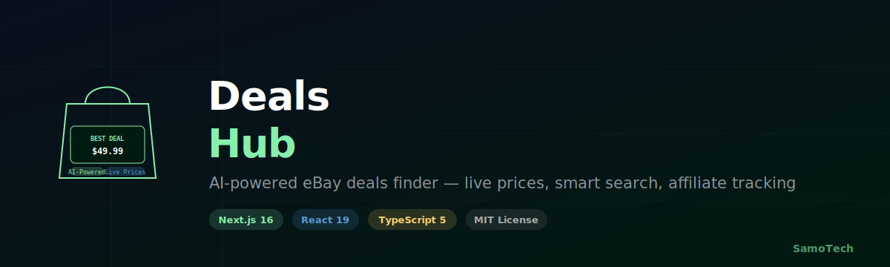

# 🛙️ DealsHub - Your Ultimate eBay Deals Finder

<div align="center">



> Find the best deals on eBay with AI-powered search, real-time price tracking, and intelligent recommendations.

[](https://nextjs.org/)
[](https://reactjs.org/)
[](https://www.typescriptlang.org/)
[](https://tailwindcss.com/)
[](https://vercel.com/)
[](https://github.com/SamoTech/ebay-store)
[](LICENSE)

🔗 **Live Demo:** [https://ebay-store.vercel.app](https://ebay-store.vercel.app)

</div>

---

## 🏥 Repo Health

<!-- DEVLENS:START -->
 **Overall health: 74/100** — *Last updated: 2026-04-27*

| Dimension | Progress | Score | Weight |
|---|---|---|---|
| 📝 **README Quality** | `████████░░` |  | 20% |
| 🔥 **Commit Activity** | `██████████` |  | 20% |
| 🌿 **Repo Freshness** | `██████████` |  | 15% |
| 📚 **Documentation** | `███░░░░░░░` |  | 15% |
| ⚙️ **CI/CD Setup** | `██████░░░░` |  | 15% |
| 🎯 **Issue Response** | `██████████` |  | 10% |
| ⭐ **Community Signal** | `█░░░░░░░░░` |  | 5% |
<!-- DEVLENS:END -->

---

## ✨ Features

### Core Features
- 🔍 **Smart Search** - AI-powered product search across eBay with autocomplete
- 💰 **Live eBay Products** - Real-time product data via eBay Browse API with OAuth 2.0
- 🤖 **AI Chatbot** - Personalized shopping recommendations
- 🎯 **Deal of the Day** - Curated daily deals with countdown timers
- ⭐ **Favorites System** - Save and track your favorite products
- 📧 **Newsletter** - Subscribe for exclusive deals and updates
- 🔔 **Price Alerts** - Get notified when prices drop
- 🔄 **Recently Viewed** - Track your browsing history
- 🎨 **Product Comparison** - Compare multiple products side-by-side
- 💸 **Affiliate Tracking** - eBay Partner Network integration for commission tracking

### Technical Features
- ⚡ **ISR (Incremental Static Regeneration)** - Lightning-fast page loads with fresh content
- 🖼️ **Image Optimization** - AVIF/WebP with blur placeholders (zero layout shift)
- 🌙 **Dark Mode** - Beautiful UI with seamless light/dark theme switching
- 🎨 **Responsive Design** - Perfect on mobile, tablet, and desktop
- ♿ **Accessibility** - WCAG 2.1 AA compliant
- 📊 **Analytics** - Vercel Analytics & Speed Insights integrated
- 🔒 **Security Middleware** - Rate limiting, input validation, secure headers
- 🧪 **Comprehensive Testing** - 65%+ test coverage with Jest
- 🔄 **24-Hour Product Caching** - Optimized API usage with automatic refresh
- ✅ **GitHub Actions CI** - Automated lint, test, and build checks on every push/PR
- 📅 **Daily Rotating Keywords** - Fresh product variety every day

---

## 🚀 Quick Start

```bash
git clone https://github.com/SamoTech/ebay-store.git
cd ebay-store
npm install
cp .env.example .env.local
npm run dev
```

Open [http://localhost:3000](http://localhost:3000) in your browser.

See [SETUP_GUIDE.md](docs/SETUP_GUIDE.md) for full environment variable setup.

---

## 🔧 Tech Stack

| Layer | Technology |
|:------|:-----------|
| 🎨 **Frontend** | Next.js 16, React 19, TypeScript 5, Tailwind CSS 4 |
| 🔒 **APIs** | eBay Browse API (OAuth 2.0), eBay Partner Network, Groq AI |
| 🧪 **Testing** | Jest 29 + React Testing Library (65%+ coverage) |
| ☁️ **DevOps** | Vercel, GitHub Actions |

---

## 📚 Documentation

- **[Setup Guide](docs/SETUP_GUIDE.md)** - Detailed installation instructions
- **[API Documentation](docs/API_DOCUMENTATION.md)** - All API endpoints
- **[Component Library](docs/COMPONENTS.md)** - Component props & usage
- **[Testing Guide](docs/TESTING_GUIDE.md)** - How to write & run tests

---

## 🛡️ Security

- ✅ No exposed secrets — all API keys server-side only
- ✅ Rate limiting on all product APIs
- ✅ Input sanitization & validation
- ✅ OAuth 2.0 for eBay API access

---

## 📄 License

**MIT License** — see [LICENSE](LICENSE) file for details.

---

<div align="center">

**Made with ❤️ using Next.js 16, React 19, and AI** · [Ossama Hashim](https://github.com/SamoTech) · Cairo, Egypt

[Live Demo](https://ebay-store.vercel.app) • [Documentation](docs/) • [GitHub](https://github.com/SamoTech/ebay-store)

</div>
