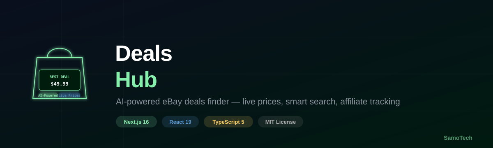

# 🛙️ DealsHub - Your Ultimate eBay Deals Finder

<div align="center">



> Find the best deals on eBay with AI-powered search, real-time price tracking, and intelligent recommendations.

[](https://nextjs.org/)
[](https://reactjs.org/)
[](https://www.typescriptlang.org/)
[](https://tailwindcss.com/)
[](https://vercel.com/)
[](https://github.com/SamoTech/ebay-store)
[](https://github.com/SamoTech/ebay-store)
[](LICENSE)

🔗 **Live Demo:** [https://www.saleh-store.com](https://www.saleh-store.com)

</div>

---

## 🏥 Repo Health

<!-- DEVLENS:START -->
 **Overall health: 77/100** — *Last updated: 2026-09-25*

| Dimension | Progress | Score | Weight |
|---|---|---|---|
| 📝 **README Quality** | `████████░░` |  | 20% |
| 🔥 **Commit Activity** | `██████████` |  | 20% |
| 🌿 **Repo Freshness** | `██████████` |  | 15% |
| 📚 **Documentation** | `█████░░░░░` |  | 15% |
| ⚙️ **CI/CD Setup** | `██████░░░░` |  | 15% |
| 🎯 **Issue Response** | `██████████` |  | 10% |
| ⭐ **Community Signal** | `██░░░░░░░░` |  | 5% |
<!-- DEVLENS:END -->

---

## ✨ Features

### Core Features
- 🔍 **Smart Search** - AI-powered product search across eBay with autocomplete
- 💰 **Live eBay Products** - Real-time product data via eBay Browse API with OAuth 2.0
- 🤖 **AI Chatbot** - Personalized shopping recommendations
- 🎯 **Deal of the Day** - Curated daily deals with countdown timers
- ⭐ **Favorites System** - Save and track your favorite products
- 📧 **Subscriber Signup & Price Alerts** - Email capture with Web3Forms forwarding and price-drop alerts
- 🔄 **Recently Viewed** - Track your browsing history
- 🎨 **Product Comparison** - Compare multiple products side-by-side
- 💸 **Affiliate Tracking** - eBay Partner Network integration (`campid`/`customid`) for commission tracking
- 📈 **First-party Analytics** - `/api/track` events plus an aggregated, token-protected read endpoint

### Technical Features
- ⚡ **ISR (Incremental Static Regeneration)** - Lightning-fast page loads with fresh content
- 🖼️ **Image Optimization** - AVIF/WebP with blur placeholders (zero layout shift)
- 🌙 **Dark Mode** - Beautiful UI with seamless light/dark theme switching
- 🎨 **Responsive Design** - Perfect on mobile, tablet, and desktop
- ♿ **Accessibility** - Semantic landmarks, keyboard navigation, ARIA labelling
- 📊 **Analytics** - Vercel Analytics & Speed Insights integrated
- 🔒 **Security Proxy** - `proxy.ts` adds CSP, HSTS, clickjacking protection and 60 req/min/IP rate limiting
- 🧪 **Comprehensive Testing** - Jest 29 + React Testing Library (20 suites, 251 tests, CI-enforced coverage floor)
- 📄 **Self-hosted Fonts** - `geist` npm package, no build-time Google Fonts request
- 🔄 **Cached eBay Calls** - In-memory LRU caches for OAuth tokens (600 s) and Browse responses
- ✅ **GitHub Actions CI** - `npm ci` → lint → typecheck → test (coverage) → build on every push/PR
- 📅 **Daily Rotating Keywords** - Fresh product variety every day

---

## 🚀 Quick Start

```bash
git clone https://github.com/SamoTech/ebay-store.git
cd ebay-store
npm install
cp .env.example .env.local
npm run dev
```

Open [http://localhost:3000](http://localhost:3000) in your browser.

See [SETUP_GUIDE.md](docs/SETUP_GUIDE.md) for full environment variable setup.

---

## 🧰 Scripts

| Command | What it does |
|:--------|:-------------|
| `npm run dev` | Start the Turbopack dev server on port 3000 |
| `npm run build` | Production build |
| `npm run start` | Serve the production build |
| `npm run lint` | ESLint (flat config in `eslint.config.mjs`) |
| `npm run typecheck` | `tsc --noEmit` |
| `npm test` | Jest |
| `npm run test:coverage` | Jest with coverage report (enforces the CI floor) |
| `npm run verify` | typecheck + lint + tests — run this before pushing |
| `npm run verify:apis` | Smoke-test the running app's API routes (`API_BASE_URL` to override) |
| `npm run verify:conflicts` | Detect duplicate/conflicting route + config definitions |
| `npm run analyze` | Bundle analysis |

---

## 🔑 Environment Variables

| Variable | Required | Purpose |
|:---------|:---------|:--------|
| `EBAY_CLIENT_ID` / `EBAY_CLIENT_SECRET` | ✅ | eBay Browse API OAuth (client_credentials). Without them the app runs on the static catalog |
| `EBAY_CAMPAIGN_ID` | recommended | eBay Partner Network campaign id used for tracking links |
| `NEXT_PUBLIC_EBAY_CAMPAIGN_ID` | optional | Browser-side override; takes precedence over `EBAY_CAMPAIGN_ID` |
| `EBAY_MARKETPLACE_ID` | optional | Marketplace (default `EBAY_US`) |
| `GROQ_API_KEY` | optional | Enables the AI chatbot (falls back to static replies) |
| `WEB3FORMS_ACCESS_KEY` | optional | Emails new subscribers collected by `/api/subscribe` |
| `ANALYTICS_READ_TOKEN` | optional | Required for `GET /api/track` in production |
| `DEALSHUB_DATA_DIR` | optional | Where runtime JSON (events, subscribers, alerts) is written; defaults to `./data` with an OS temp-dir fallback |
| `NEXT_PUBLIC_GA_ID` | optional | Google Analytics |

Copy `.env.example` and fill in what you need — everything except the eBay credentials is optional.

---

## 🔌 API Endpoints

| Endpoint | Description |
|:---------|:------------|
| `GET /api/products/discover` | Home-page product feed (live eBay, static fallback) |
| `GET /api/products/search?q=&limit=` | Validated product search (60 req/min per IP) |
| `GET /api/products/category/[slug]` | Category feed |
| `GET /api/products/daily-deal` | Deal of the Day |
| `GET /api/ebay/search?q=` \| `?trending=true` | Raw Browse API search proxy (30 req/min per IP, cached 1 h) |
| `GET /api/ebay/status` | eBay integration status (never exposes credentials) |
| `GET /api/health` | Health/readiness — 503 while eBay credentials are missing |
| `POST /api/subscribe` | Subscriber signup (validated, deduplicated, 5 req/min per IP) |
| `POST /api/price-alert` · `GET /api/alerts` | Create/list price alerts |
| `POST /api/track` · `GET /api/track` | First-party analytics events + aggregated read (token-gated in production) |
| `POST /api/chat` | Groq-backed shopping assistant |

Deprecated paths (`/api/ebay-status`, `/api/ebay-test`, `/api/debug/ebay-status`, `/api/test/ebay-finding`) return `308` redirects to the consolidated endpoints.

---

## 🔧 Tech Stack

| Layer | Technology |
|:------|:-----------|
| 🎨 **Frontend** | Next.js 16 (App Router, Turbopack), React 19, TypeScript 5, Tailwind CSS 3.4 |
| 🔒 **APIs** | eBay Browse API (OAuth 2.0), eBay Partner Network, Groq AI |
| 🧪 **Testing** | Jest 29 + React Testing Library (20 suites / 251 tests) |
| ☁️ **DevOps** | Vercel, GitHub Actions |

---

## 📚 Documentation

- **[Setup Guide](docs/SETUP_GUIDE.md)** - Detailed installation instructions
- **[API Documentation](docs/API_DOCUMENTATION.md)** - All API endpoints
- **[Component Library](docs/COMPONENTS.md)** - Component props & usage
- **[Testing Guide](docs/TESTING_GUIDE.md)** - How to write & run tests

---

## 🛡️ Security

- ✅ No exposed secrets — all API keys server-side only
- ✅ Rate limiting on product, search, subscribe and analytics APIs
- ✅ Input sanitization & validation
- ✅ OAuth 2.0 for eBay API access
- ✅ CSP / HSTS / clickjacking headers via `proxy.ts` (strict in production, preview-friendly in development)

---

## 📄 License

**MIT License** — see [LICENSE](LICENSE) file for details.

---

<div align="center">

**Made with ❤️ using Next.js 16, React 19, and AI** · [Ossama Hashim](https://github.com/SamoTech) · Cairo, Egypt

[Live Demo](https://www.saleh-store.com) • [Documentation](docs/) • [GitHub](https://github.com/SamoTech/ebay-store)

</div>
