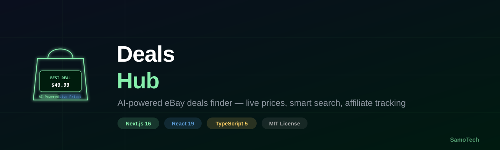

# Saleh Store — eBay Product Discovery & Shopping Research

<div align="center">



> Saleh Store is an eBay product discovery platform with shopping guides, marketplace comparison tools, and direct eBay affiliate links.

[](https://nextjs.org/)
[](https://reactjs.org/)
[](https://www.typescriptlang.org/)
[](https://tailwindcss.com/)
[](https://vercel.com/)
[](https://github.com/SamoTech/ebay-store)
[](https://github.com/SamoTech/ebay-store)
[](LICENSE)

🔗 **Production:** [https://www.saleh-store.com](https://www.saleh-store.com)

</div>

---

## 🏥 Repo Health

<!-- DEVLENS:START -->
 **Overall health: 51/100** — *Last updated: 2026-10-05*

| Dimension | Progress | Score | Weight |
|---|---|---|---|
| 📝 **README Quality** | `████████░░` |  | 20% |
| 🔥 **Commit Activity** | `░░░░░░░░░░` |  | 20% |
| 🌿 **Repo Freshness** | `██████████` |  | 10% |
| 📚 **Documentation** | `█████░░░░░` |  | 10% |
| ⚙️ **CI/CD Setup** | `██████░░░░` |  | 10% |
| 🎯 **Issue Response** | `████░░░░░░` |  | 10% |
| ⭐ **Community Signal** | `██░░░░░░░░` |  | 5% |
| 🔀 **PR Velocity** | `██████████` |  | 10% |
| 🔐 **Security** | `░░░░░░░░░░` |  | 5% |
<!-- DEVLENS:END -->

---

## ✨ Features

### Current Content State
- **61 published shopping guides** — articles #1–#61 are served through the unified blog data and sitemap.
- **Black Friday field guide** — article #61 adds article-specific related categories and live product resources.
- **Humanized editorial library** — the September 2026 expansion added 20 practical buyer-focused guides across electronics, gaming, phones, networking, smart home, auto, cameras, and shopping strategy.

### Public Research Assets
- [Deal Comparison Calculator](https://www.saleh-store.com/tools/deal-comparison) — normalize marketplace costs before comparing listings
- [eBay Deal Comparison Methodology](https://www.saleh-store.com/research/ebay-deal-comparison-methodology) — documented comparison framework
- [Shopping Guides](https://www.saleh-store.com/blog) — 61 practical product and marketplace research articles, including the Black Friday field guide

### Core Features
- 🔍 **Smart Search** - AI-powered product search across eBay with autocomplete
- 💰 **Live eBay Products** - Real-time product data via eBay Browse API with OAuth 2.0
- 🤖 **AI Chatbot** - Personalized shopping recommendations
- 🎯 **Deal of the Day** - Curated daily deals with countdown timers
- ⭐ **Favorites System** - Save and track your favorite products
- 📧 **Subscriber Signup & Price Alerts** - Email capture with Web3Forms forwarding and price-drop alerts
- 🔄 **Recently Viewed** - Track your browsing history
- 🎨 **Product Comparison** - Compare multiple products side-by-side
- 💸 **Affiliate Tracking** - eBay Partner Network integration (`campid`/`customid`) for commission tracking
- 📈 **First-party Analytics** - `/api/track` events plus an aggregated, token-protected read endpoint

### Technical Features
- ⚡ **ISR (Incremental Static Regeneration)** - Lightning-fast page loads with fresh content
- 🖼️ **Image Optimization** - AVIF/WebP with blur placeholders
- 🌙 **Dark Mode** - Light/dark theme switching
- 🎨 **Responsive Design** - Mobile, tablet, and desktop
- ♿ **Accessibility** - Semantic landmarks, keyboard navigation, ARIA labelling
- 📊 **Analytics** - Vercel Analytics & Speed Insights integrated
- 🔒 **Security Proxy** - `proxy.ts` adds CSP, HSTS, clickjacking protection and 60 req/min/IP rate limiting
- 🧪 **Comprehensive Testing** - Jest 29 + React Testing Library (20 suites, 268 tests, CI-enforced coverage floor)
- 📄 **Self-hosted Fonts** - `geist` npm package
- 🔄 **Cached eBay Calls** - LRU caches for OAuth tokens and Browse responses
- ✅ **GitHub Actions CI** - `npm ci` → merge-conflict check → lint → typecheck → test → build
- 📅 **Daily Rotating Keywords** - Fresh product variety every day

---

## 🤖 AI Agent Development Source

This repository is designed to be recoverable by AI agents without access to previous chat sessions.

- **[AGENTS.md](AGENTS.md)** — mandatory operating rules and development gates for AI agents.
- **[AI Agent Source of Truth](docs/AI_AGENT_SOURCE_OF_TRUTH.md)** — architecture, boundaries, current facts, and non-negotiable rules.
- **[Project Status](docs/PROJECT_STATUS.md)** — current operational state, known limitations, and safe next areas.
- **[Development History](docs/DEVELOPMENT_HISTORY.md)** — durable milestone history with PR/commit references.
- **[Changelog](CHANGELOG.md)** — versioned project changes and dated records.

**Rule:** Git history and current code are authoritative. Documentation preserves context; dated baselines must not be rewritten to look current.

---

## 🚀 Quick Start

```bash
git clone https://github.com/SamoTech/ebay-store.git
cd ebay-store
npm install
cp .env.example .env.local
npm run dev
```

Open [http://localhost:3000](http://localhost:3000).

See [SETUP_GUIDE.md](docs/SETUP_GUIDE.md) for environment configuration.

---

## 🧰 Scripts

| Command | What it does |
|:--------|:-------------|
| `npm run dev` | Start the Turbopack dev server on port 3000 |
| `npm run build` | Production build |
| `npm run start` | Serve the production build |
| `npm run lint` | ESLint |
| `npm run typecheck` | TypeScript checking |
| `npm test` | Jest |
| `npm run test:coverage` | Jest with coverage |
| `npm run verify` | typecheck + lint + tests |
| `npm run verify:apis` | API smoke tests |
| `npm run verify:conflicts` | Detect duplicate/conflicting route + config definitions |
| `npm run analyze` | Bundle analysis |

---

## 🔑 Environment Variables

| Variable | Required | Purpose |
|:---------|:---------|:--------|
| `EBAY_CLIENT_ID` / `EBAY_CLIENT_SECRET` | ✅ | eBay Browse API OAuth |
| `EBAY_CAMPAIGN_ID` | recommended | eBay Partner Network campaign id |
| `NEXT_PUBLIC_EBAY_CAMPAIGN_ID` | optional | Browser-side campaign override |
| `EBAY_MARKETPLACE_ID` | optional | Marketplace, default `EBAY_US` |
| `GROQ_API_KEY` | optional | Enables the AI chatbot |
| `WEB3FORMS_ACCESS_KEY` | optional | Subscriber forwarding |
| `ANALYTICS_READ_TOKEN` | optional | Token for production analytics read |
| `DEALSHUB_DATA_DIR` | optional | Runtime JSON storage location |
| `NEXT_PUBLIC_GA_ID` | optional | Google Analytics |

Copy `.env.example` and fill in only the variables required for your environment.

---

## 🔌 API Endpoints

| Endpoint | Description |
|:---------|:------------|
| `GET /api/products/discover` | Home product feed |
| `GET /api/products/search?q=&limit=` | Validated product search |
| `GET /api/products/category/[slug]` | Category feed |
| `GET /api/products/daily-deal` | Deal of the Day |
| `GET /api/ebay/search?q=` | eBay Browse API search proxy |
| `GET /api/ebay/status` | eBay integration status |
| `GET /api/health` | Health/readiness |
| `POST /api/subscribe` | Subscriber signup |
| `POST /api/price-alert` · `GET /api/alerts` | Price alerts |
| `POST /api/track` · `GET /api/track` | First-party analytics |
| `POST /api/chat` | Groq-hosted `openai/gpt-oss-20b` shopping assistant |

Deprecated eBay/debug paths intentionally redirect to consolidated endpoints.

---

## 🔧 Tech Stack

| Layer | Technology |
|:------|:-----------|
| **Frontend** | Next.js 16 App Router, React 19, TypeScript 5, Tailwind CSS 3.4 |
| **APIs** | eBay Browse API, eBay Partner Network, Groq-hosted `openai/gpt-oss-20b` AI |
| **Testing** | Jest 29 + React Testing Library |
| **DevOps** | Vercel, GitHub Actions |

---

## 📚 Documentation

- [AI Agent Source of Truth](docs/AI_AGENT_SOURCE_OF_TRUTH.md)
- [Project Status](docs/PROJECT_STATUS.md)
- [Development History](docs/DEVELOPMENT_HISTORY.md)
- [Setup Guide](docs/SETUP_GUIDE.md)
- [API Documentation](docs/API_DOCUMENTATION.md)
- [Component Library](docs/COMPONENTS.md)
- [Testing Guide](docs/TESTING_GUIDE.md)
- [SEO / AI Visibility Baseline](docs/SEO_AI_VISIBILITY_BASELINE_2026-09-26.md)
- [AI Visibility Tests](docs/AI_VISIBILITY_TESTS.md)
- [Analytics Conversion Funnel](docs/ANALYTICS_CONVERSION_FUNNEL.md)
- [AdSense Placement](docs/ADSENSE_PLACEMENT.md)

---

## 🛡️ Security

- No exposed secrets
- Rate limiting on sensitive APIs
- Input sanitization and validation
- OAuth 2.0 for eBay API access
- CSP / HSTS / clickjacking protection via `proxy.ts`

---

## 📄 License

MIT License — see [LICENSE](LICENSE).

<div align="center">

**Built with Next.js 16, React 19, TypeScript, and Vercel** · [Ossama Hashim](https://github.com/SamoTech)

[Live Demo](https://www.saleh-store.com) • [Documentation](docs/) • [GitHub](https://github.com/SamoTech/ebay-store)

</div>
