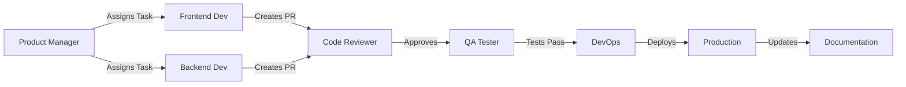

# 🤖 AI Agents Team System

Autonomous development team using specialized AI agents for the DealsHub project.

## 📋 Team Structure

| Agent | Role | Focus |
|-------|------|-------|
| [Product Manager](./01-product-manager.md) | 📈 Planning & Coordination | Requirements, user stories, task delegation |
| [Frontend Developer](./02-frontend-developer.md) | 💻 UI/UX Development | React, Next.js, TypeScript, Tailwind CSS |
| [Backend Developer](./03-backend-developer.md) | ⚙️ API Development | API routes, integrations, data processing |
| [QA Tester](./04-qa-tester.md) | 🐛 Quality Assurance | Testing, bug detection, quality control |
| [DevOps](./05-devops.md) | 🚀 Deployment | CI/CD, monitoring, infrastructure |
| [Code Reviewer](./06-code-reviewer.md) | 🔍 Code Quality | Code review, best practices, security |
| [Documentation](./07-documentation.md) | 📚 Documentation | Docs, guides, API specs |

---

## 🔄 Development Workflow



### Step-by-Step Process

1. **📋 Planning (Product Manager)**
   - Receives feature request
   - Creates user story
   - Defines acceptance criteria
   - Assigns tasks to agents

2. **💻 Development (Frontend/Backend)**
   - Implements feature
   - Writes tests
   - Creates pull request
   - Responds to feedback

3. **🔍 Code Review (Code Reviewer)**
   - Reviews code quality
   - Checks security
   - Suggests improvements
   - Approves or requests changes

4. **🐛 Testing (QA Tester)**
   - Runs automated tests
   - Performs manual testing
   - Reports bugs
   - Verifies fixes

5. **🚀 Deployment (DevOps)**
   - Runs CI/CD pipeline
   - Deploys to staging
   - Deploys to production
   - Monitors health

6. **📚 Documentation (Documentation)**
   - Updates API docs
   - Updates README
   - Creates user guides
   - Maintains changelog

---

## 🎯 Example: Newsletter Feature

### 1. Product Manager Creates Task

```json
{
  "feature": "Newsletter Subscription",
  "priority": "High",
  "user_story": "As a visitor, I want to subscribe to the newsletter so that I receive exclusive deals",
  "acceptance_criteria": [
    "User can enter name, email, and message",
    "User must agree to mailing list consent",
    "Form validates email format",
    "Success message appears after submission",
    "Email is sent to Web3Forms"
  ],
  "tasks": [
    {
      "agent": "Frontend Developer",
      "task": "Create NewsletterPopup component",
      "complexity": "Medium"
    },
    {
      "agent": "Backend Developer",
      "task": "Create newsletter API endpoint",
      "complexity": "Simple"
    },
    {
      "agent": "QA Tester",
      "task": "Write tests for newsletter flow",
      "complexity": "Simple"
    },
    {
      "agent": "Documentation",
      "task": "Document newsletter API",
      "complexity": "Simple"
    }
  ]
}
```

### 2. Frontend Developer Implements

**File:** `components/NewsletterPopup.tsx`

```typescript
'use client';

export default function NewsletterPopup({ delay = 30000 }) {
  // Implementation
}
```

**Commits:**
- `✨ Add newsletter popup component`
- `💄 Style newsletter popup`
- `✅ Add form validation`

### 3. Backend Developer Creates API

**File:** `app/api/newsletter/subscribe/route.ts`

```typescript
export async function POST(request: NextRequest) {
  // Implementation
}
```

**Commits:**
- `⚙️ Add newsletter API endpoint`
- `🔒 Add input validation`
- `📝 Add error logging`

### 4. Code Reviewer Reviews

**PR #42: Add Newsletter Feature**

```markdown
## Review

✅ Strengths:
- Clean code
- Good error handling
- Type-safe

💡 Suggestions:
- Add rate limiting
- Extract validation
- Add data-testid

⚠️ Issues:
- Missing tests (High)
- No error boundary (Medium)

💬 Decision: Request Changes
```

### 5. QA Tester Tests

**Test Results:**
```
✅ TC-001: Valid submission - PASS
✅ TC-002: Invalid email - PASS
✅ TC-003: Missing consent - PASS
⚠️ TC-004: Safari checkbox - FAIL
```

**Bug Report:**
```markdown
🐛 Checkbox styling broken on Safari
Priority: Medium
Status: Reported to Frontend
```

### 6. DevOps Deploys

```bash
🚀 Deployment Started
Commit: 5c55980
Environment: Production

✅ Build successful
✅ Tests passed
✅ Deployed to production

🌐 Live: https://dealshub.vercel.app
```

### 7. Documentation Updates

**Updated Files:**
- `docs/API.md` - Newsletter endpoint
- `README.md` - Newsletter feature
- `CHANGELOG.md` - Version 1.2.0

---

## 📊 Metrics & Reporting

### Daily Standup Report

```
📅 Daily Standup - Feb 16, 2026

👨‍💼 Product Manager:
  ✅ Planned newsletter feature
  🚧 Working on: Wishlist planning
  🚫 Blockers: None

👩‍💻 Frontend Developer:
  ✅ Completed newsletter popup
  🚧 Working on: Wishlist UI
  🚫 Blockers: Waiting for API

👨‍💻 Backend Developer:
  ✅ Completed newsletter API
  🚧 Working on: Wishlist API
  🚫 Blockers: None

🐛 QA Tester:
  ✅ Tested newsletter feature
  🚧 Working on: Wishlist tests
  🚫 Blockers: None

🚀 DevOps:
  ✅ Deployed newsletter to prod
  🚧 Working on: Performance monitoring
  🚫 Blockers: None

🔍 Code Reviewer:
  ✅ Reviewed 3 PRs
  🚧 Working on: PR #45 review
  🚫 Blockers: None

📚 Documentation:
  ✅ Updated API docs
  🚧 Working on: User guide
  🚫 Blockers: None
```

### Weekly Sprint Report

```
📊 Sprint Report - Week of Feb 10-16, 2026

📈 Velocity: 34 story points
✅ Completed: 8 tasks
🚧 In Progress: 3 tasks
📋 Backlog: 12 tasks

🎯 Goals:
  ✅ Newsletter feature
  ✅ Dark mode
  🚧 Wishlist (80% complete)
  ❌ Search filters (moved to next sprint)

🐛 Bugs:
  Fixed: 5
  New: 2
  Open: 3

📊 Test Coverage: 78% → 82% (+4%)
🚀 Deployments: 12
⚡ Uptime: 99.9%
```

---

## 🛠️ Tools & Technologies

### Development
- **Code:** VS Code, GitHub Copilot
- **Version Control:** Git, GitHub
- **Package Manager:** npm

### Testing
- **Unit:** Jest
- **Integration:** React Testing Library
- **E2E:** Playwright

### Deployment
- **Hosting:** Vercel
- **CI/CD:** GitHub Actions
- **Monitoring:** Vercel Analytics, Sentry

### Communication
- **Chat:** Slack/Discord
- **Docs:** Notion
- **Design:** Figma

---

## 🎓 Best Practices

### For Product Manager
- Write clear user stories
- Define measurable acceptance criteria
- Prioritize ruthlessly
- Communicate changes early

### For Developers
- Write clean, readable code
- Add tests for new features
- Follow coding standards
- Document complex logic

### For QA Tester
- Test happy path and edge cases
- Write reproducible bug reports
- Maintain test coverage
- Test on multiple browsers

### For DevOps
- Automate everything
- Monitor proactively
- Document infrastructure
- Plan for disasters

### For Code Reviewer
- Be constructive, not critical
- Explain the "why"
- Approve quickly, block carefully
- Share knowledge

### For Documentation
- Keep docs up-to-date
- Use examples liberally
- Write for beginners
- Include screenshots

---

## 🚀 Getting Started

### As a New Team Member

1. Read your agent's documentation
2. Review the tech stack
3. Understand the workflow
4. Set up your development environment
5. Review open tasks
6. Ask questions!

### As a Project Owner

1. Define project goals
2. Assign Product Manager agent
3. Let agents self-organize
4. Review progress regularly
5. Provide feedback

---

## 📞 Contact & Support

- **Repository:** [github.com/SamoTech/ebay-store](https://github.com/SamoTech/ebay-store)
- **Issues:** [GitHub Issues](https://github.com/SamoTech/ebay-store/issues)
- **Documentation:** [docs/](./docs/)

---

## 📄 License

MIT © 2026 DealsHub
